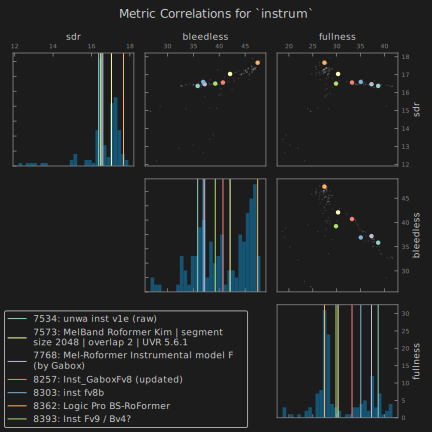
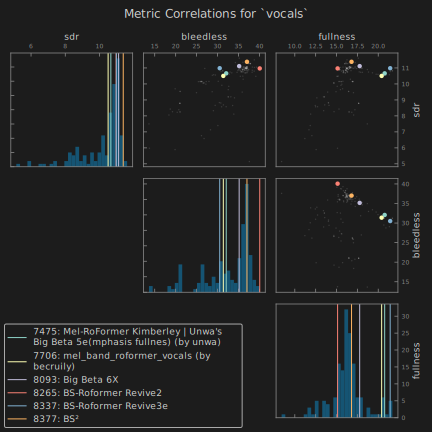

More information on the expected JSON schema for the configuration can be found in [splifft.config.Config][].

## Supported models

### BS Roformer

- checkpoint: [`roformer-fp16.pt`](https://github.com/undef13/splifft/releases/download/v0.0.1/roformer-fp16.pt)
- configuration: [`bs_roformer.json`](https://github.com/undef13/splifft/blob/main/data/config/bs_roformer.json)
- [`config.model`][splifft.models.bs_roformer.BSRoformerConfig]
- [`config.model_type = "bs_roformer"`][splifft.config.Config.model_type]

## Visualizations

The following are quick comparisons for the quality of different models, as evaluated on MVSep. Support for running these models are not yet implemented but may come in a future release.

<!--
https://github.com/undef13/splifft/blob/main/scripts/mvsep.py
uv run scripts/mvsep.py --instruments instrum --id 7534 --id 7573 --id 7768 --id 8257 --id 8303 --id 8393 --id 8362
uv run scripts/mvsep.py --instruments vocals --id 7475 --id 7706 --id 8093 --id 8265 --id 8337 --id 8377
-->

=== "Instrumental"

    

=== "Vocals"

    

